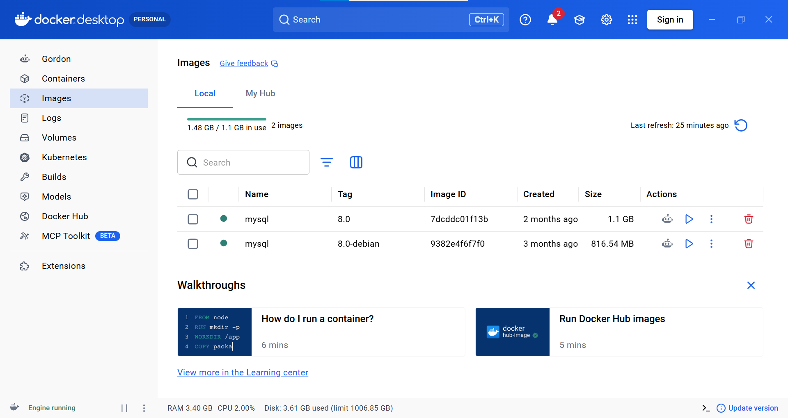
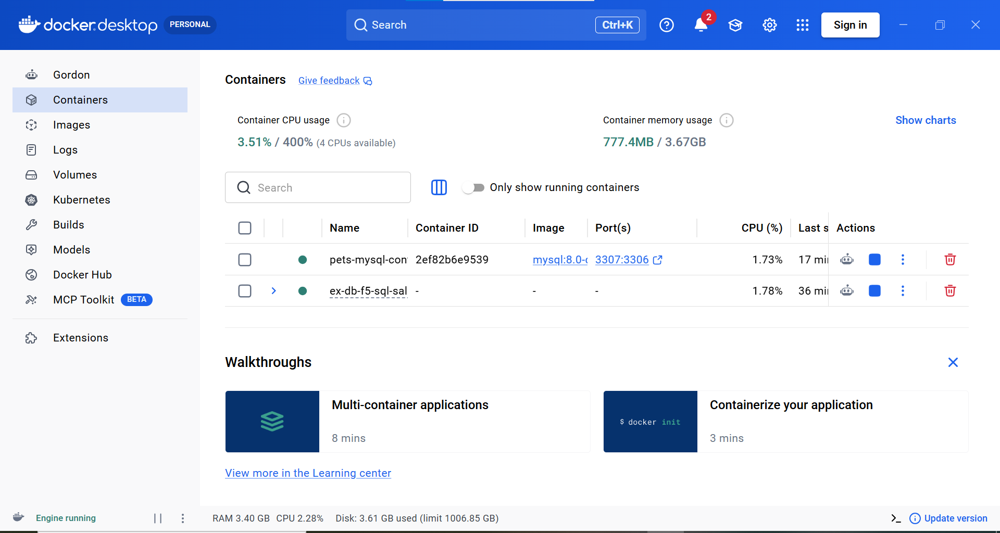
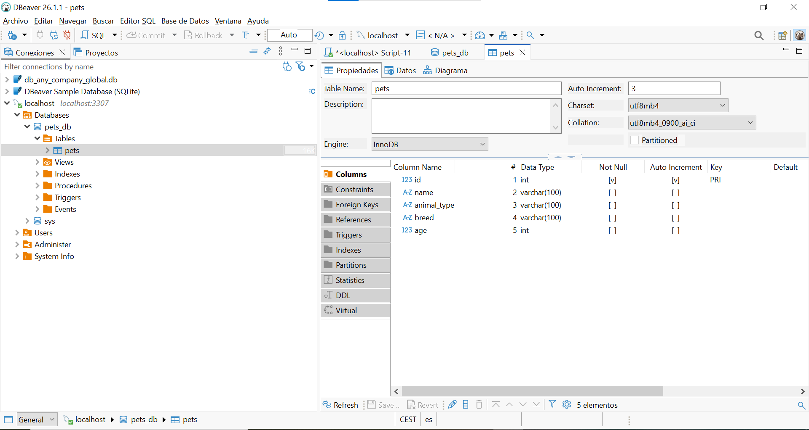
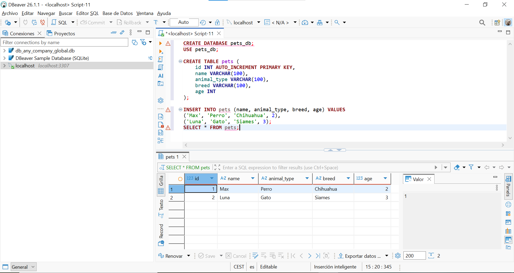
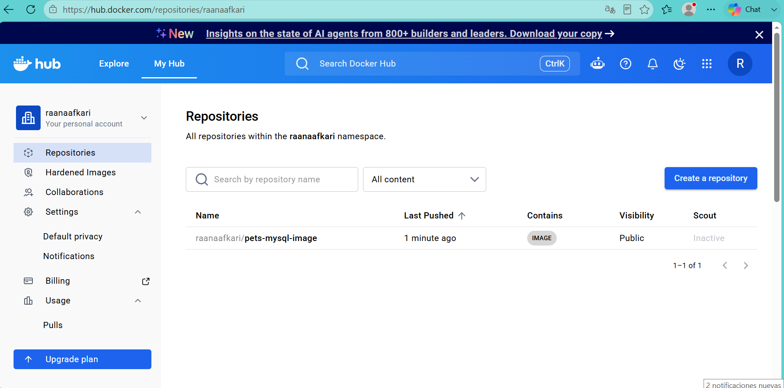

# ex-f5-docker-mysql-image-project

Practice project: creating a Docker image and container with MySQL, managing a database, and pushing the image to DockerHub.

## Objective

- Learn how to create a Docker container
- Create a database
- Manage a database

## Technologies used

- Docker Desktop
- MySQL 8.0 (image `mysql:8.0-debian`)
- DBeaver
- DockerHub

## Steps performed

1. Pulled the official `mysql:8.0-debian` image from Docker Hub.
2. Created and ran a container based on that image (`pets-mysql-container`, port 3307).
3. Connected to the container using DBeaver.
4. Created the `pets_db` database.
5. Created the `pets` table with columns: `id`, `name`, `animal_type`, `breed`, `age`.
6. Inserted 2 sample records (Max and Luna).
7. Pushed the image to DockerHub as `raanaafkari/pets-mysql-image:1.0`.

## Screenshots

### 1. Docker Desktop — Images section



### 2. Docker Desktop — Containers section



### 3. Database created in DBeaver



### 4. SQL statement to list pets and result



### 5. Image pushed to DockerHub



## Commands used

```bash
docker pull mysql:8.0-debian
docker run --name pets-mysql-container -p 3307:3306 -e MYSQL_ROOT_PASSWORD=PetsProject123 -d mysql:8.0-debian
docker tag mysql:8.0-debian raanaafkari/pets-mysql-image:1.0
docker push raanaafkari/pets-mysql-image:1.0
```

```sql
CREATE DATABASE pets_db;
USE pets_db;

CREATE TABLE pets (
    id INT AUTO_INCREMENT PRIMARY KEY,
    name VARCHAR(100),
    animal_type VARCHAR(100),
    breed VARCHAR(100),
    age INT
);

INSERT INTO pets (name, animal_type, breed, age) VALUES
('Max', 'Perro', 'Chihuahua', 2),
('Luna', 'Gato', 'Siames', 3);

SELECT * FROM pets;
```